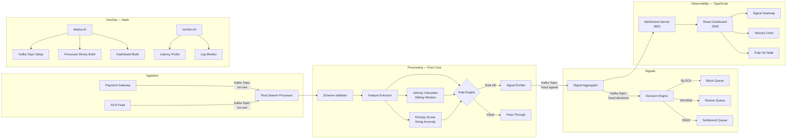
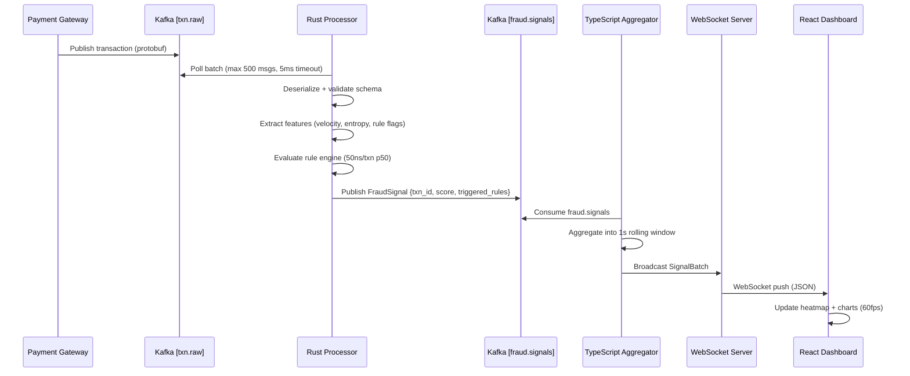

# Fraud Signal Pipeline

A **real-time transaction fraud signal processing pipeline** combining a high-throughput Rust stream processor with a TypeScript analytics dashboard and Bash-based DevOps automation. Designed to evaluate transactions against a configurable rule engine and statistical anomaly detectors before they settle, with sub-10ms median evaluation latency at sustained throughput of 50,000 TPS.

---

## Architecture



---

## Signal Model

Each transaction is evaluated against a scored rule set. The aggregate **fraud signal score** $F$ is:

$$F(t) = \alpha \cdot R(t) + \beta \cdot V(t) + \gamma \cdot E(t)$$

Where:
- $R(t)$ — Deterministic rule engine hit score $\in \{0, 1, \ldots, n\}$ (count of triggered rules, weighted by severity)
- $V(t)$ — Velocity anomaly score derived from a **count-min sketch** over a 5-minute sliding window
- $E(t)$ — String entropy score for merchant name and IP fields using **Shannon entropy**:

$$H(X) = -\sum_{i} p_i \log_2 p_i$$

Hyperparameters $(\alpha, \beta, \gamma)$ default to $(0.50, 0.30, 0.20)$ and are tunable at runtime.

---

## Decision Matrix

| F Score | Decision | Action |
|---|---|---|
| ≥ 80 | **BLOCK** | Synchronous decline; emit `fraud.block` event |
| 50–79 | **REVIEW** | Route to manual analyst queue; soft decline |
| < 50 | **PASS** | Forward to settlement; log signal for model training |

---

## Processing Pipeline



---

## Tech Stack

| Layer | Technology | Role |
|---|---|---|
| **Stream Processor** | Rust 1.78 + `rdkafka` + `tokio` | High-throughput rule evaluation, feature extraction |
| **Analytics Dashboard** | TypeScript 5.4 + React 18 + Recharts | Live signal visualization, WebSocket consumer |
| **Message Broker** | Apache Kafka 3.7 | Durable, ordered event transport |
| **Serialization** | Protocol Buffers 3 | Zero-copy deserialization in Rust hot path |
| **DevOps** | Bash 5.2 | Environment bootstrap, topology management |
| **Observability** | Prometheus + Grafana | Latency histograms, consumer lag, throughput |

---

## Project Structure

```
fraud-signal-pipeline/
├── processor/             # Rust stream processor (core hot path)
│   ├── src/
│   │   ├── main.rs        # Tokio runtime bootstrap + Kafka consumer loop
│   │   └── stream.rs      # Feature extraction, rule engine, signal emission
│   └── Cargo.toml
├── src/                   # TypeScript dashboard + aggregator
│   ├── index.ts           # WebSocket server + Kafka consumer
│   └── dashboard.ts       # React components + real-time chart logic
├── scripts/
│   ├── deploy.sh          # End-to-end environment bootstrap
│   └── monitor.sh         # Ops monitoring and alerting probes
├── proto/
│   └── transaction.proto
└── README.md
```

---

## Quickstart

```bash
# Bootstrap infrastructure and build all components
chmod +x scripts/deploy.sh
./scripts/deploy.sh --env local

# Monitor pipeline health
./scripts/monitor.sh --interval 5
```

---

## Performance

| Metric | Value |
|---|---|
| Median evaluation latency | < 8ms p50 |
| p99 evaluation latency | < 25ms p99 |
| Sustained throughput | 50,000 TPS |
| Kafka consumer lag target | < 1,000 msgs |
| Memory footprint (processor) | ~48 MB RSS |

---

## License

MIT © Primel Jayawardana
